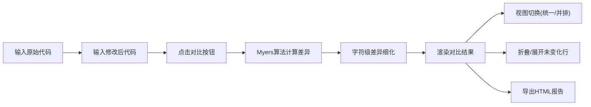

## 1. 产品概述

代码差异对比工具，提供类似GitHub Diff视图的代码对比体验。用户可输入两段代码进行精确的差异比对，支持行级和字符级高亮，多种视图模式切换，以及结果导出功能。

- 解决的问题：开发者需要快速识别代码修改的具体差异，传统文本对比工具精度不足
- 目标用户：软件开发者、代码审查人员、技术文档编写者
- 产品价值：提供直观、高效、精确的代码差异可视化，提升代码审查和修改分析效率

## 2. 核心功能

### 2.1 用户角色
| 角色 | 注册方式 | 核心权限 |
|------|----------|----------|
| 普通用户 | 无需注册 | 使用全部对比功能、导出结果 |

### 2.2 功能模块
1. **主页面**: 代码输入区、视图切换、对比结果展示、操作工具栏

### 2.3 页面详情
| 页面名称 | 模块名称 | 功能描述 |
|----------|----------|----------|
| 主页面 | 左侧代码输入框 | 输入原始代码（支持多语言代码高亮） |
| 主页面 | 右侧代码输入框 | 输入修改后的代码（支持多语言代码高亮） |
| 主页面 | 提交对比按钮 | 触发差异计算，展示对比结果 |
| 主页面 | 视图切换 | 在统一视图和并排视图之间切换 |
| 主页面 | 对比结果区 | 显示差异结果，支持行级和字符级高亮 |
| 主页面 | 折叠/展开功能 | 连续未变化的行默认折叠，点击可展开/折叠 |
| 主页面 | 导出HTML报告 | 将对比结果导出为独立的HTML文件 |

## 3. 核心流程

用户进入页面后，在左右两个文本框中分别粘贴或输入原始代码和修改后的代码。点击"对比"按钮后，系统使用Myers差分算法计算最小编辑操作序列。结果以可视化方式呈现：新增行以绿色背景高亮、删除行以红色背景高亮，行内字符级别的变化也会被精确标记。用户可通过视图切换按钮在统一视图和并排视图之间切换。连续3行以上未变化的内容默认折叠，点击折叠区域可展开查看完整上下文。用户可点击"导出HTML"按钮将当前对比结果导出为可独立浏览的HTML报告文件。

## 4. 用户界面设计

### 4.1 设计风格
- **主色调**: 深灰色背景（#1e1e2e），配合代码编辑器暗色主题
- **辅助色**: 新增行绿色（#22c55e / #166534），删除行红色（#ef4444 / #991b1b），字符级高亮使用更饱和的色块
- **按钮风格**: 圆角矩形，轻微阴影，悬停时有颜色过渡动画
- **字体**: 代码区域使用 JetBrains Mono 等宽字体，界面文本使用现代无衬线字体
- **布局风格**: 卡片式布局，顶部工具栏 + 中部输入区 + 下部结果区，整体为深色代码编辑器风格
- **图标风格**: 使用 Lucide 线性图标，简洁现代

### 4.2 页面设计概览
| 页面名称 | 模块名称 | UI元素 |
|----------|----------|--------|
| 主页面 | 顶部工具栏 | 标题、视图切换按钮组、导出按钮、操作按钮 |
| 主页面 | 代码输入区 | 左右并排两个带行号的文本输入框，带标签标识"原始代码"和"修改后代码" |
| 主页面 | 对比结果区 | 带行号的差异面板，支持滚动同步，折叠指示条 |
| 主页面 | 状态栏 | 显示差异统计信息（新增行数、删除行数、修改行数） |

### 4.3 响应式
桌面端优先设计，移动端自适应：小屏幕下代码输入框改为上下排列，并排视图自动切换为统一视图模式，触控优化折叠/展开区域。
