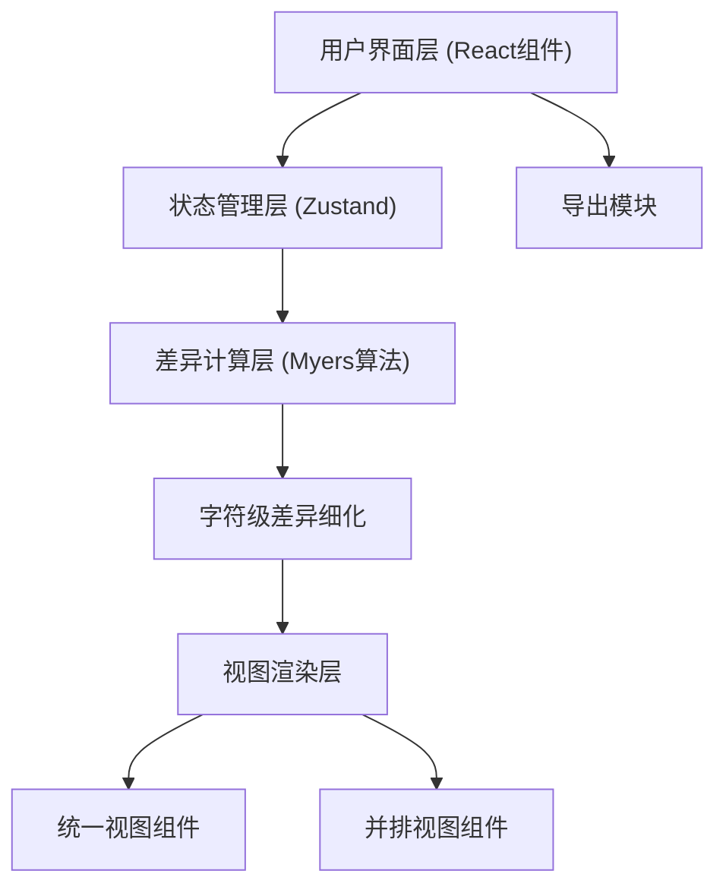

## 1. 架构设计



## 2. 技术说明

- **前端**: React@18 + TypeScript + tailwindcss@3 + Vite
- **初始化工具**: vite-init
- **后端**: 无（纯前端应用）
- **数据库**: 无
- **状态管理**: Zustand
- **图标库**: lucide-react
- **核心算法**: Myers差分算法（自行实现）

## 3. 路由定义

| 路由 | 用途 |
|------|------|
| / | 主页面 - 代码差异对比工具 |

## 4. 数据模型

### 4.1 差异类型定义

```typescript
// 差异行类型
enum DiffLineType {
  EQUAL = 'equal',      // 未变化
  INSERT = 'insert',    // 新增
  DELETE = 'delete',    // 删除
}

// 单行差异数据
interface DiffLine {
  type: DiffLineType;
  content: string;
  oldLineNumber: number | null;
  newLineNumber: number | null;
  inlineDiffs?: InlineDiff[];  // 行内字符级差异
}

// 字符级差异
interface InlineDiff {
  type: DiffLineType;
  value: string;
}

// Myers算法中间结果 - 编辑操作
interface EditOperation {
  type: 'insert' | 'delete' | 'equal';
  oldIndex: number;
  newIndex: number;
}

// 折叠区域
interface CollapsedRegion {
  startLine: number;
  endLine: number;
  lineCount: number;
}
```

## 5. 核心模块划分

| 模块 | 路径 | 职责 |
|------|------|------|
| Myers差分算法 | `src/utils/myersDiff.ts` | 实现Myers最小编辑距离算法，输出编辑操作序列 |
| 字符级差异 | `src/utils/inlineDiff.ts` | 对修改行进行字符级的精确差异计算 |
| 差异格式化 | `src/utils/diffFormatter.ts` | 将算法结果格式化为渲染所需的DiffLine数组 |
| HTML导出 | `src/utils/exportHtml.ts` | 将对比结果导出为独立HTML文件 |
| 状态管理 | `src/store/diffStore.ts` | 管理代码输入、对比结果、视图模式等状态 |
| 主页面 | `src/pages/Home.tsx` | 整合所有组件的主页面 |
| 代码输入组件 | `src/components/CodeInput.tsx` | 带标签的代码输入文本框 |
| 统一视图组件 | `src/components/UnifiedView.tsx` | 统一Diff视图渲染 |
| 并排视图组件 | `src/components/SplitView.tsx` | 并排Diff视图渲染 |
| 工具栏组件 | `src/components/Toolbar.tsx` | 视图切换、导出、操作按钮 |
| 差异行组件 | `src/components/DiffLine.tsx` | 单行差异渲染（含字符级高亮） |
| 折叠区域组件 | `src/components/CollapsedHunk.tsx` | 未变化行的折叠/展开交互 |
